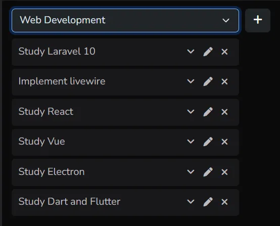

# Task Manager

**NOTE:** Please view this readme on [github](https://github.com/jerome-shiftleft/coalition-technologies) so you can view the embedded images and view the intended readme style/format.

## Installation

 Download/clone this [repository](https://github.com/jerome-shiftleft/coalition-technologies)

 **NOTE:** To avoid running into command errors, please use linux-compatible terminal such as git bash
```
git clone git@github.com:jerome-shiftleft/coalition-technologies.git taskmanager
cd taskmanager
```

Copy ***.env.example*** file and name it ***.env***
```
cp .env.example .env
```
Update ***.env*** file. Change `APP_URL` to match your virtual host url.<br>
This is **optional but highly recommended** if you want to utilize **browsersync (hot reload)** when using **`npm run watch`**
```
APP_URL=https://taskmanager.local
```
Install composer and node module packages by running the following commands.
```
composer install
php artisan key:generate
npm install
npm run dev
```
### Setup Database
Create a database. Below are sample commands
```
mysql -u root -p --default-character-set=utf8mb4
```
```
create database taskmanager character set utf8mb4 collate utf8mb4_unicode_ci;
```
Update `.env` file to match your database.
```
DB_CONNECTION=mysql
DB_HOST=127.0.0.1
DB_PORT=3306
DB_DATABASE=taskmanager
DB_USERNAME=root
DB_PASSWORD=
```
Run **`php artisan migrate --seed`** to generate dummy data for the database.<br>
Run **`php artisan migrate:fresh --seed`** or **`source seed.sh`** if you want to regenerate fresh new dummy data.<br>
The generated dummy data are random latin words. If you want english dummy data that makes sense, you can import ***database/dump/test.sql***
```
mysql -u root -p taskmanager
```
```
source database/dump/test.sql;
```

## Task Manager Usage

### Viewing Tasks
Select a project first then the tasks under that project will show.


<br><br>
Click the caret icon &nbsp;&nbsp; &nbsp;&nbsp; to view the task description.


### Create Task
Click the plus (+) button and the create task modal will popup.


### Edit Task
Click the pen icon &nbsp;&nbsp;&nbsp;&nbsp; on the task you want to edit and the update task modal will popup.<br>


### Sorting Task Priority
Drag the task title to reorder the task priority.


## Compiling Assets (Laravel Mix)

**`npm run dev`** compiles assets for development. Generates source maps for better debugging.<br><br>
**`npm run watch`** compiles assets for development, just like **`npm run dev`** but watches files for changes.<br>
If you modify any source file, it will automatically recompile the affected assets.<br>
Useful during development to automatically compile assets as you work without needing to run the build command repeatedly.<br>
If **`BROWSER_SYNC=true`** in .env, it will automatically reloads the browser after compiling.<br><br>
**`npm run prod`** compiles assets for production. Minifies the code to reduce file size.

**NOTE**: The following files are included in .gitignore to prevent merge conflicts when compiling assets and deploying.<br>
**If you fetch updates, ensure you recompile the assets on your machine or server**.

- public/mix-manifest.json
- public/css/app.css
- public/css/app-sass.css
- public/js/app.js
- public/js/vendor.js
- public/js/manifest.js
- public/js/app.js.LICENSE.txt
- public/js/vendor.js.LICENSE.txt

## Code Review
This project utilized laravel mix and laravel livewire.
Here are the location of some important files/folders.

entry page: ***/resources/views/dashboard/index.blade.php***<br>
layout: ***/resources/views/layouts/dashboard.blade.php***

livewire classes: ***/app/Http/livewire***<br>
livewire views: ***/resources/views/livewire***

js files: ***/resources/js***<br>
sass files: ***/resources/sass***

laravel mix config: ***/webpack.mix.js***

## Additional Packages Installed

### Composer Packages
- [Laravel Livewire](https://laravel-livewire.com)

### NPM Packages

#### devDependencies
- [imagemin](https://www.npmjs.com/package/imagemin)
- [imagemin-webp](https://www.npmjs.com/package/imagemin-webp) - used by **`npm run webp`**

### dependencies
- [bootstrap](https://www.npmjs.com/package/bootstrap)
- [popperjs](https://www.npmjs.com/package/@popperjs/core)
- [jquery](https://www.npmjs.com/package/jquery)
- [jquery-ui](https://www.npmjs.com/package/jquery-ui)
- [alpinejs](https://www.npmjs.com/package/alpinejs)
- [livewire-sortable](https://www.npmjs.com/package/livewire-sortable)
- [fontawesome](https://www.npmjs.com/package/@fortawesome/fontawesome-free)
- [select2](https://www.npmjs.com/package/select2)

## License

The Laravel framework is open-sourced software licensed under the [MIT license](https://opensource.org/licenses/MIT).
